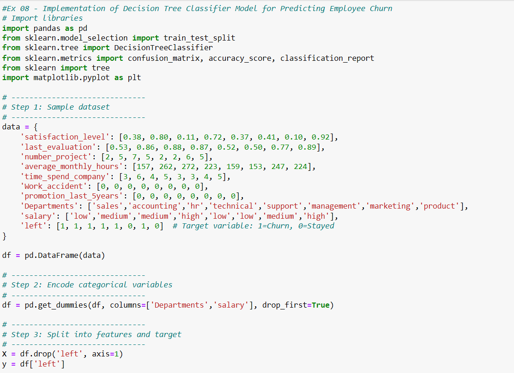
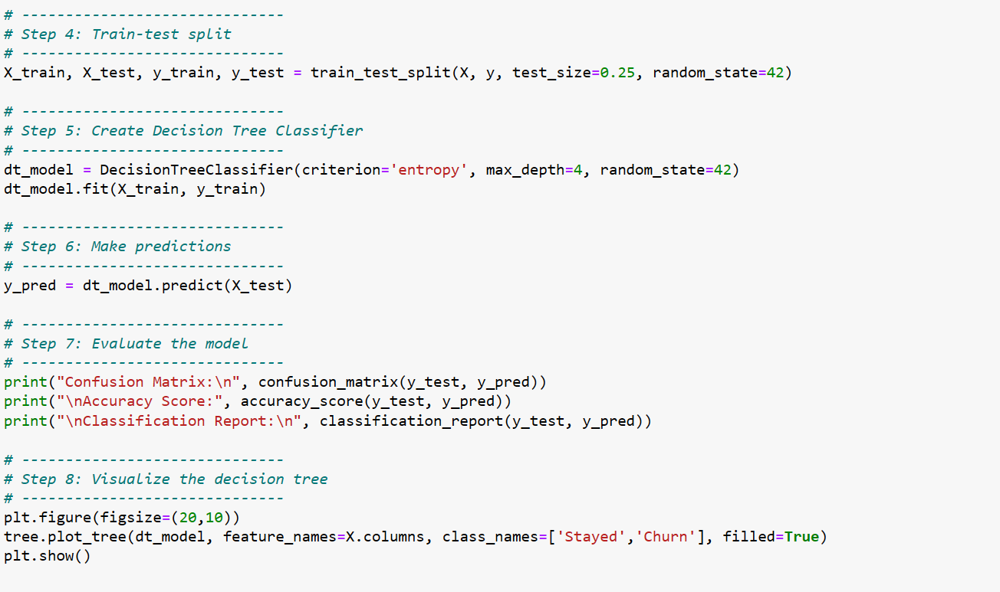
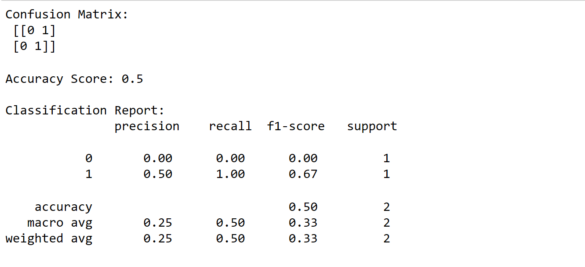
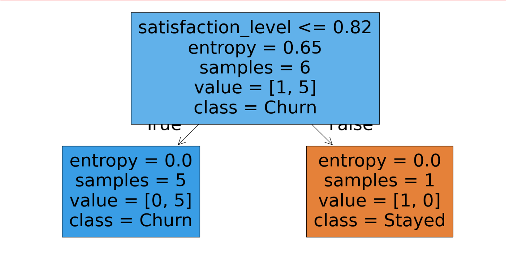

# Implementation-of-Decision-Tree-Classifier-Model-for-Predicting-Employee-Churn

## AIM:
To write a program to implement the Decision Tree Classifier Model for Predicting Employee Churn.

## Equipments Required:
1. Hardware – PCs
2. Anaconda – Python 3.7 Installation / Jupyter notebook

## Algorithm

1.Import the required libraries for data handling, plotting, and Decision Tree classification.

2.Load the Employee dataset and convert categorical data into numerical format using get_dummies().

3.Split the dataset into input features (X) and target output (y), then divide the data into training and testing sets.

4.Create and train the DecisionTreeClassifier model using the training data, then predict the output for test data.

5.Calculate the accuracy of the model and display the Decision Tree diagram using plot_tree().

Program:

## Program:
```
/*
Program to implement the Decision Tree Classifier Model for Predicting Employee Churn.

#Ex 08 - Implementation of Decision Tree Classifier Model for Predicting Employee Churn
# Import libraries
import pandas as pd
from sklearn.model_selection import train_test_split
from sklearn.tree import DecisionTreeClassifier
from sklearn.metrics import confusion_matrix, accuracy_score, classification_report
from sklearn import tree
import matplotlib.pyplot as plt

# ------------------------------
# Step 1: Sample dataset
# ------------------------------
data = {
    'satisfaction_level': [0.38, 0.80, 0.11, 0.72, 0.37, 0.41, 0.10, 0.92],
    'last_evaluation': [0.53, 0.86, 0.88, 0.87, 0.52, 0.50, 0.77, 0.89],
    'number_project': [2, 5, 7, 5, 2, 2, 6, 5],
    'average_monthly_hours': [157, 262, 272, 223, 159, 153, 247, 224],
    'time_spend_company': [3, 6, 4, 5, 3, 3, 4, 5],
    'Work_accident': [0, 0, 0, 0, 0, 0, 0, 0],
    'promotion_last_5years': [0, 0, 0, 0, 0, 0, 0, 0],
    'Departments': ['sales','accounting','hr','technical','support','management','marketing','product'],
    'salary': ['low','medium','medium','high','low','low','medium','high'],
    'left': [1, 1, 1, 1, 1, 0, 1, 0]  # Target variable: 1=Churn, 0=Stayed
}

df = pd.DataFrame(data)

# ------------------------------
# Step 2: Encode categorical variables
# ------------------------------
df = pd.get_dummies(df, columns=['Departments','salary'], drop_first=True)

# ------------------------------
# Step 3: Split into features and target
# ------------------------------
X = df.drop('left', axis=1)
y = df['left']

# ------------------------------
# Step 4: Train-test split
# ------------------------------
X_train, X_test, y_train, y_test = train_test_split(X, y, test_size=0.25, random_state=42)

# ------------------------------
# Step 5: Create Decision Tree Classifier
# ------------------------------
dt_model = DecisionTreeClassifier(criterion='entropy', max_depth=4, random_state=42)
dt_model.fit(X_train, y_train)

# ------------------------------
# Step 6: Make predictions
# ------------------------------
y_pred = dt_model.predict(X_test)

# ------------------------------
# Step 7: Evaluate the model
# ------------------------------
print("Confusion Matrix:\n", confusion_matrix(y_test, y_pred))
print("\nAccuracy Score:", accuracy_score(y_test, y_pred))
print("\nClassification Report:\n", classification_report(y_test, y_pred))

# ------------------------------
# Step 8: Visualize the decision tree
# ------------------------------
plt.figure(figsize=(20,10))
tree.plot_tree(dt_model, feature_names=X.columns, class_names=['Stayed','Churn'], filled=True)
plt.show()

Developed by: Swathi P N
RegisterNumber:  212225230279
*/
```

## Output:









## Result:
Thus the program to implement the  Decision Tree Classifier Model for Predicting Employee Churn is written and verified using python programming.
